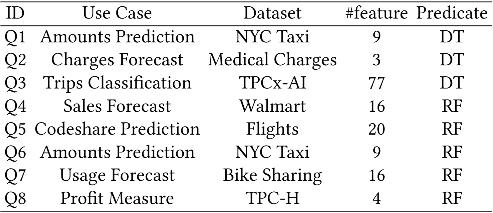

# ReTree Experiments

This document outlines the experimental components of our paper *Eliminating Redundant Feature Tests in Decision Tree and Random Forest Inference on SQL Predicates*.

## What is ReTree

ReTree is a flexible and pluggable extension built on top of DuckDB, designed to eliminate redundant feature tests in decision tree and random forest predicates. The source code resides in the [`duckdb`](https://anonymous.4open.science/r/duckdb-2DB7) submodule, with its core implementation primarily located in `duckdb/test/extension/retree_xxx_extension.cpp`. Additionally, the [onnxoptimizer](https://anonymous.4open.science/r/onnx_optimizer_C-34DE/) submodule within DuckDB also contains part of the ReTree implementation, specifically under the path `onnxoptimizer/query_c_api/retree.cpp`. 

## Experiments in Our Paper

In this paper, we evaluate the performance of the ReTree prototype system through a series of experiments conducted on publicly available datasets and standard benchmark workloads, including TPC-H and TPCx-AI. The experiments include:

- Efficiency of Sibling-Centric Elimination
  - End-to-end Execution Time
  - Evaluation Overhead Analysis
  - Selectivity of ML Predicates
- Efficiency of Ancestor-Centric Elimination
  - End-to-end Execution Time
  - Evaluation Overhead Analysis
  - Impact of Sliding Hyperplane Types
- Accuracy of Random Forest Predicates
- Discussion
  - Comparison with Alternative Approaches
  - Scalability
    - Query Performance on Large-scale Data
    - Query Performance across Tree Depths

## Workloads

The `workloads` directory contains datasets: `bike_sharing_demand`, `flights`, `medical_charges`, `nyc-taxi-green-dec-2016`, and `walmart_sales`.

In each dataset folder:

- The `xxx.csv` file contains the original dataset.
- The `train_xxx.py` scripts are used for training machine learning models.
- Data scaling is achieved by replication via the `data/xxx_expand.py` scripts.

The `tpch-q9` and `tpcxai-uc08` directories include only model training scripts, as the full datasets are too large to be included directly. The TPC-H dataset can be generated using the official TPC-H toolkit available at [https://www.tpc.org/tpch/ ](https://www.tpc.org/tpch/) and TPCx-AI dataset can be obtained using the TPCx-AI toolkit from [https://www.tpc.org/tpcx-ai/ ](https://www.tpc.org/tpcx-ai/).

## Queries

Each dataset directory includes `common/xxx.sql` file that contains SQL statements to load the ReTree extension. The experimental prediction queries are stored in `workload/xxx/query.sql`, corresponding to the queries described in the evaluation section of our paper, as shown in the following table.

